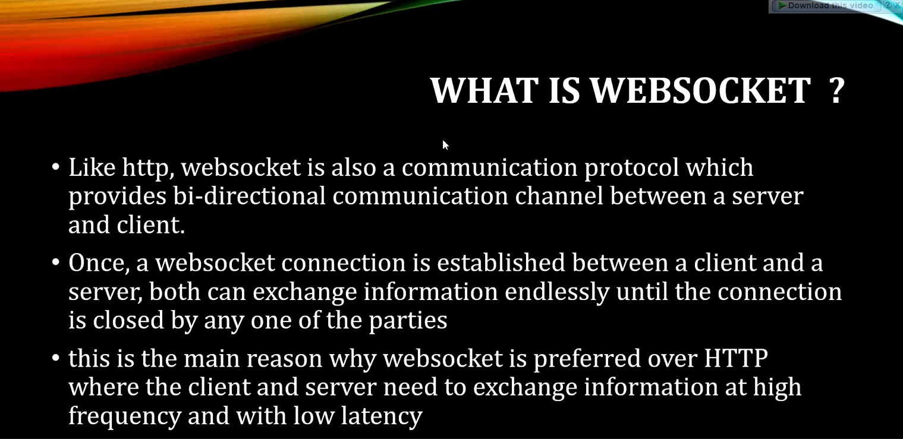
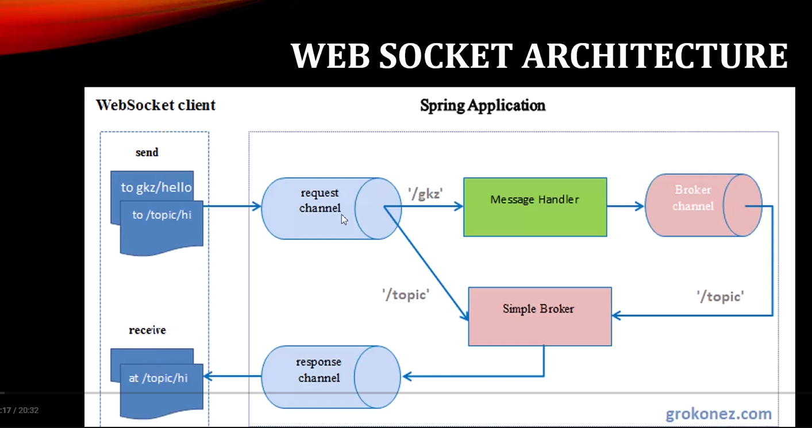
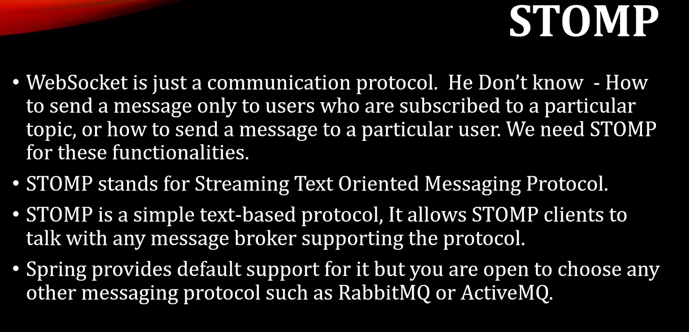

# WHAT IS WEBSOCKET ?

# WEB SOCKET ARCHITECTURE

# STOMP

# Spring Boot Websocket Chat Application Example

📌 Spring Boot Websocket Chat Application Example

(Readable formatting, same wording)

Hi everyone, in this tutorial we are going to discuss about spring boot with websocket integration and we are going to global chart application using this secret concept.

So before start this development let me give some overview socket and communication protocol.

🧩 What is WebSocket?

Like a 3DP web circuit is also a communication protocol which provides bidirectional communication channel between a server and client OK.

⭐ Advantages

Once a web socket connection is established between a client and a server, both can exchange information endlessly until the connection is closed by anyone of them.

This is the main reason why web circuit is preferred over a 3DP where the client and server need to exchange their information.

But in case of HTTP, the connection is closed once a request is served by a server and even there is also a time constraint to open a new connection again.

So that's why Websocket is more preferable in case of this bidirectional communication development.

🧱 Architecture Overview

This is the typical architecture of websocket and spring application:

From websocket client URL the request will come to the request channel.
Based on the URL it will go to the simple blocker or message broker.
The message broker helps us to route the data to corresponding response channel.

From response channel whoever the server is available they can get the data.
We are going to send text data over the request channel → message broker → response channel → receiver section.

🔁 Why STOMP protocol?

WebSocket is just a communication protocol — it doesn't know:

how to send a message to a particular user

how to send a message to users subscribed to a topic

To do these things, we need STOMP.

STOMP = Streaming Text Oriented Messaging Protocol, a simple text based protocol that allows STOMP clients to talk with any message broker.

Spring provides default support, but other brokers like RabbitMQ / ActiveMQ can also be used.

🛠️ Development Steps

Go to Eclipse → Create a Spring Boot project.

Name: springboot-websocket

Description: Develop a chat application using Spring Boot and WebSocket.

Package name: spring.wok.api

Add dependency → Websocket

⚙️ Add Additional Dependency

To achieve full websocket features using STOMP, add one more dependency.

(Your config steps remain same)

🏗️ Create Packages
.config
.controller
.model

⚙️ WebSocket Config

enable stomp endpoint

configure message broker

set application destination prefix

🧩 Model

ChatMessage with fields:

String content
String sender
MessageType type (JOIN / LEAVE / CHAT)

🧠 Controller

Two methods:

register

send message

💻 Frontend (JavaScript + HTML UI)

Use SockJS + STOMP

Same endpoints as config

Subscribe to /topic/public

Send to /app/chat.send and /app/chat.register

UI display: message feed, join/leave notifications.

🚀 Run

Start Spring Boot → open browser:

http://localhost:8080/

Open multiple browser windows to test real-time chat.

🎯 Result

Users join → notification appears

Users send messages → all connected users see it

User leaves → notification appears (if JS logic prints correctly)

📌 Summary

WebSocket + STOMP + Spring Boot = real-time chat system.

👍 Done!

* Hi everyone in this tutorial we are going to discuss about spring boot with websocket integration and we are going to global chart application using this secret concept. So before start this development let me give some overview socket and communication protocol. So what is Websocket? Like a 3DP web circuit is also a communication protocol which provides bidirectional communication channel between a server and client OK. So the advantages of huge web circuit. Once a web socket connection is established between a client and a server, both can exchange information endlessly until the connection is closed by anyone of them. OK. So this is the main reason why web circuit is preferred over a 3DP where the client and server need to exchange their information. But in case of HTTP, the connection is closed once a request is served by a server and even there is also a time constraint to open a new connection again. So that's why Websocket is more preferable in case of this bidirectional communication development. Now let's understand this Websocket and Spring architecture. Ready to feel the difference in the way you work with multiple databases? Data grip a powerful. So this is the typical architecture of websocket and spring application. So from websocket client. URL so the request will come to the request channel based on the URL it will go to the simple blocker or we can say or message broker. Here the message broker helps us to route the data to corresponding response channel. From response channel whoever the server is available they can get the data. So normally in this architecture we are going to send a text data over the request channel and it will move it to the message broker. From message broker we are going to route it to the response channel and we will get the. Response back in receiver section OK. So to play with the text data over the request channel and response channel we need to depends on another protocol that is the storm protocol. So now you should think even though we have websocket protocol for communication purpose why we need this tom protocol OK. So Websocket is just a communication protocol. He don't know how to send a message to a particular user or how to send a message to those user who subscribe to a particular topic. So to achieve these things you need to use those terms. So basically Storm stands for Streaming Text Oriented Messaging protocol and Storm is a simple text based protocol. It allows Storm client to talk with any message broker supporting the protocol. So. Spring provides default support for it, but if you want you can choose another message in protocol such as Rabbit Enqueue or Active MQ, OK. So this is just basic overview about the Websocket protocol and its architecture and the stone protocol. To extend the data in the format of text. So you will get more clarity once you start the developing. So now let's go to the eclipse. Let's create a server side application. Then we will add the client side application OK. So let's go to the eclipse.Create a Springboard project. Nu spring startle project. Change the name here. Springbok websocket. Change the description. Develop a chat application. Using Springboot and Websocket. Now change the package here. Spring wok API. Now click next. Now let's add the required dependency. Let's add only the web socket dependency now. Click Next. Click Finish. So our application imported successfully. XXL. In Pondus XML we added only the web circuit. So to achieve full web circuit features is you storm you need to add one more dependency. So let me copy that. Let's adhere. OK now let's create a few packets. Let's create a package for configuration. New tickets. Dot config. Similarly creative a case for controller. Now create one more package for our model. Dot Mountain. OK so now let's first create our configuration. So we need to enable the TOM protocol and our message broker here. So create a class. Give the name something like WS config. So annotate this class as adorate configuration. Now we need to enable the websocket server. So for that right enable websocket message mocha OK. Now we need to implement it from. Wolf socket some message broker. Yeah, wolf circuit message broker configure. OK so here you need to overwrite two methods 14 register store endpoint. Where it is, yeah. And another for message broker. Register to the middle name. Configure message broker. OK in case of storm end point you need to provide a refix URL here.So is that into registry? Dot add endpoint OK so here let me give the endpoint for our. Storm. Something like Java Tiki OK. Now whether you are in you need to add the support of soft JS socket JS OK. So the advantages of use this socket JS here. Whenever the whole circuit connection is disconnect or the wave circuit connection cannot be established here then that time connection will be downgrade to HTTP and the communication between client and server still continue OK. So that's why we are using with socket there support here. So now we need to enable the configure message broker. So that you need to provide the URL registry dot. Enable Simple broker. So here you need to provide the URL something like slash topic. OK and do you need to add the registry dot set application destination prefix here OK. So let's give it up something like that OK. You can specify any URL the same URL you need to configure in our client side. So now here we are done with the configuration. Now let's create the model. And creating model something like message OK. Or you can change it to something like chat message. Let's make it more meaningful. So here let's add few feel something like flyweight. String content what content you want to send and who is going to send so private string. Sender. And let's add one more in on something like that. To check whether the sender is joined or he left the chart OK or he is containing the chart. So for that let me create a inner. Public you know, something like. Message type. OK so you specify something like chart. Leave or join. Now let's use this. Type type. OK so now let's create the Gator setter for. We created the model, we created the configuration file. Now let's create the controller. He created the configuration file. Now let's create the control. Critics class something like. Jot control one. Unintended this one at the red controller. OK So what we can do here we can add two methods, one is to add user to the chat then for send message OK. So first let's write the method. The form to write for register. So let's name it as register first. The user need to be registered in the portal then only can able to chat. Wanna get the sun and the red Pearl? So you can observe the tail load is coming from messaging earlier analytic. This annotation is not related with our MDC annotation OK. To capture the request there is annotation slash page and here we need to capture that username who is going to chat now who is currently in joint state. OK so to get that in one class. Something like SIM? OK so first year the session attribute. Then in Sesame Street put the username who is going to. Register now. OK. Now simply let's return that. It's our permissions. So here we need to annotate at the rate. Message mapping. This annotation helps us to map the same URL from client to our server OK. So specify something like. Start the register. And Daniel, take one more at the rate send two. OK this sand tool will help to specify the cube like the request channel and response channel based on the URL. Specifically something like slash topic which we mentioned in our config file, right? The simple book or routing purport slash topic. Specify the same philosophy slash read something like public OK. Now write one more method to the continue the chart. Only return the same chat message. The Thornhill something like sale by 6 and give the request charge message. You don't know send chat message. And I did here also message mapping and send let me copy this which has the URL. For message mapping. slashchat.sing and slash topic slash public is the same request, general and response which I want to mention. OK so we are done with our server side, we did the configuration, we create the model and you wrote the two end .1 for register the user, another one for. To send a message OK so now to add the client side details we need to add few method in UI side using Java screen. So I have that template let me add so that I can explain it. So let me go to the main resource, let me copy that folder. And there is a. HTML which will display first and put wrong local host 8080. Only for awesome start chatting to register and then our chart dialog. Let me show you the function first in JavaScript. If you observe. Soft jazz, I'm providing Java Tiki the same I mentioned in my config file right to enable the storm endpoint. So I specify your slash zabatiki. So the same you need to specify in JavaScript function. If go down there is a subscribe to the public topic, we have slash topic slash public the same URL which we mentioned in our control room with send 2 annotation right and this is what the destination prefix will configured in our Douglas config. If you observe this is slash so every request it will happen slash up as a pre fix that is the destination prefixes. OK so slica then our message mapping you are register. Register similarly you have chart dot send. And here I want to show the status. Well you know me created the the user is join or remove OK. Join. Deep Mushil is in chat. That's what I want to show you. Connect and send these two methods JavaScript method OK so if if anyone know UI will talk so we can customize the UI and we can make it more beautiful OK. So let's run our application to test it. Glades Ronak. Java application. 8080 OK so broker availability event available through. Let's go to the browser and test our UI. 8080 it will add to register and giving something like twitter. OK start setting let me open another browser. OK. So here you can see Peter Joint, Maria joint and here Maria joint. So let's type here. Marios and Hi Peter. From here she can sell. How are you? OK so this is the chat like google chat so here all the user who are joined here they can able to see the chat with the name. So this UI function is done with the JavaScript. I copied this template from some other side so if you know you can make it more better so like this they can chat. Suppose this guy want to left. You can get the notification like let me show you one second. Let me open one more browser control shift in. Zerk and Zen. Start setting Passenger India. So here you got the notification person. OK so let me close this. It should display here. No it's not displaying. Something is going wrong in this driver script function. So it should display like something like that OK. So that we can change in name of this, I am not much over on this US. So yeah guys that's it about this particular video. If anyone have any doubt or function we can add a comment and those who not subscribe there, please go ahead and subscribe it. And don't forget to press the bell icon guys so that you won't miss any update from my tutorial and thanks for watching this video.